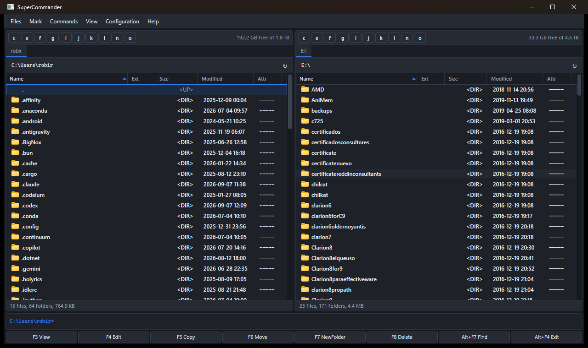
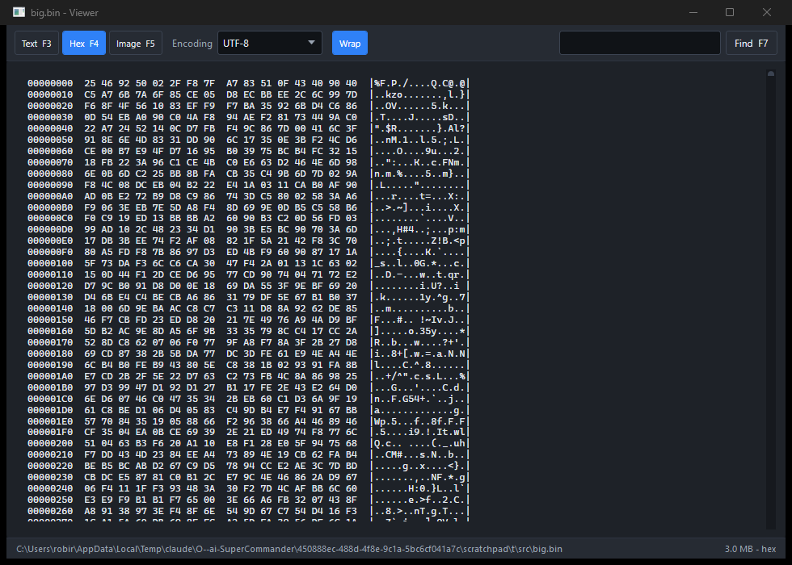
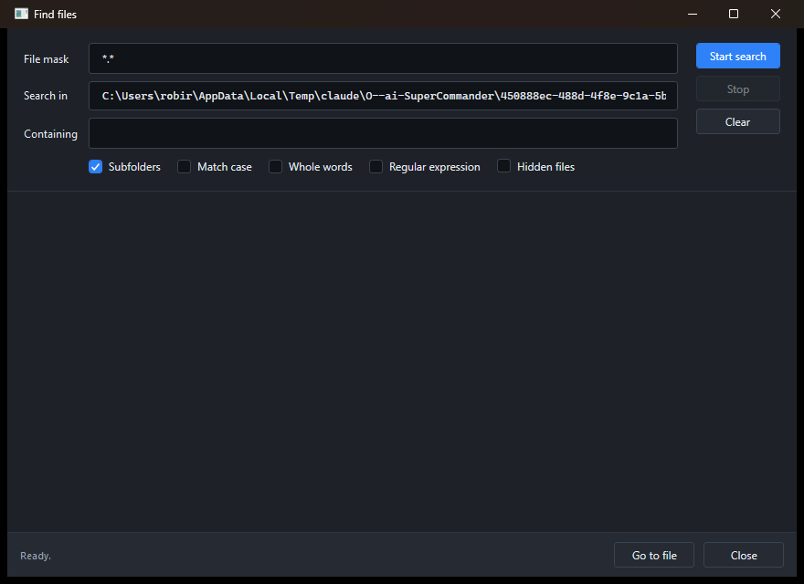
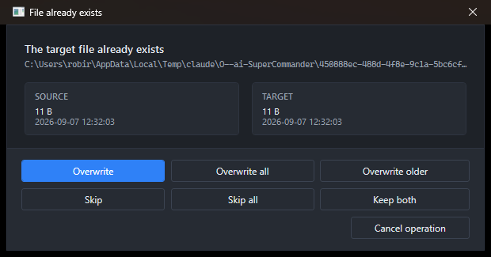
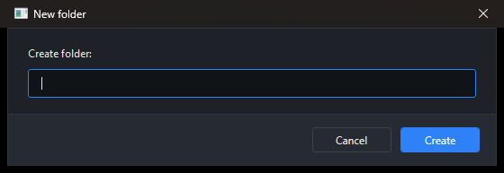
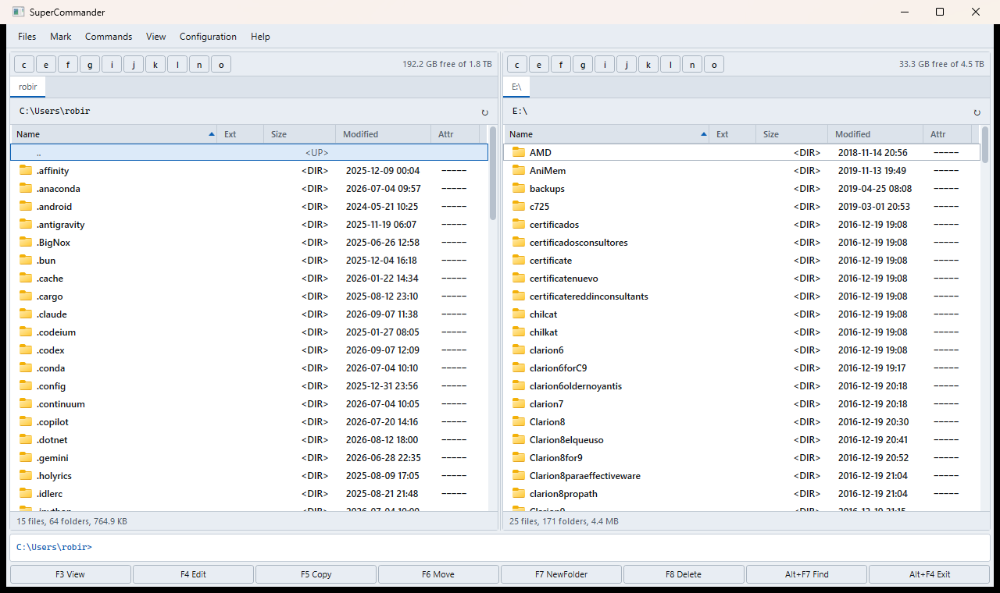

# SuperCommander

A dual-pane orthodox file manager for Windows, in the tradition of Total Commander.
Written in C# and WPF on .NET 9, with **no third-party dependencies** — everything
is the base framework plus direct Win32/COM interop.



---

## Contents

- [Highlights](#highlights)
- [Themes](#themes)
- [Keyboard reference](#keyboard-reference)
- [Building and running](#building-and-running)
- [Architecture](#architecture)
- [Where settings live](#where-settings-live)
- [Known limits](#known-limits)

---

## Highlights

### Two panes, the orthodox way

- Independent panes, each with its own tab strip, drive bar, sort order and history.
- **Cursor and marks are separate.** Arrow keys move the cursor; `Insert`,
  `Space`, `Ctrl+click` and `Shift+click` mark files. Commands act on the marked
  set, or on the cursor row when nothing is marked — exactly the Total Commander
  rule. Marking is additive, so a plain click never loses what you already
  picked; `Esc` clears.
- The cursor is drawn as an accent outline rather than a filled bar, so per-type
  colouring (folders, executables, archives, hidden files) and the marked colour
  stay readable underneath it.
- Sortable `Name / Ext / Size / Modified / Attr` columns with a natural sort, so
  `file2` comes before `file10`.
- Per-pane status line with counts and marked/total byte totals, plus free space.

### Real shell integration

- **Genuine Explorer context menus** via `IShellFolder::GetUIObjectOf` and
  `IContextMenu`, including owner-drawn third-party entries — the host window is
  hooked for `IContextMenu2`/`IContextMenu3` callbacks while the popup tracks.
- **System icons** from `SHGetFileInfo`, cached per extension and loaded on a
  background thread so a folder with 50,000 files still paints instantly.
- **Recycle Bin deletes** through `SHFileOperation` with undo, or `Shift+Delete`
  for a permanent wipe.
- The native **property sheet** on `Alt+Enter`.
- **Explorer-compatible clipboard** (`Preferred DropEffect`), so `Ctrl+X` here and
  `Ctrl+V` in Explorer behaves the way you expect.
- **Drag and drop** to and from Explorer and between panels. A drag that starts
  in a panel carries the rows themselves, not just paths, so dropping onto an FTP
  panel uploads and dragging off one downloads. Explorer's rule sets the default
  effect locally (move within a volume, copy across volumes); anything crossing
  to or from a server defaults to copy so a mistake cannot delete the original.
  `Ctrl` / `Shift` force copy or move.

### File operations

- Threaded copy / move engine with byte-level progress, live throughput and ETA,
  and cancellation that leaves no half-written file behind.
- Deletes run on a dedicated STA thread, which the shell file APIs require, and
  the result is verified rather than trusted - `SHFileOperation` reports success
  even when it silently did nothing.
- Full conflict dialog — Overwrite, Overwrite all, Overwrite older, Skip, Skip all,
  Keep both, Cancel — showing both sizes and dates with the newer one highlighted.
- Same-volume moves are a rename, so they are instant.
- Timestamps and attributes are preserved on copy.

### Beyond the basics

| Feature | How to reach it |
| --- | --- |
| Internal viewer — text (5 encodings), hex dump, images | `F3` |
| Browse *inside* a `.zip` as if it were a folder | `Enter` on the archive |
| Pack to `.zip` / unpack | `Alt+F5` / `Alt+F9` |
| Find files by mask, size, date and **file contents** (literal or regex) | `Alt+F7` |
| Multi-rename tool with live preview and `[N] [E] [C] [P] [Y][M][D]` patterns | `Ctrl+M` |
| Branch view — every file below here, flattened | `Ctrl+B` |
| Calculate folder sizes | `Space` or `Ctrl+L` |
| Compare directories and mark what differs | `Mark` menu |
| Quick filter and type-to-jump search | `Ctrl+S`, or just start typing |
| Bookmarks | `Ctrl+D` |
| Command line with `cd` and drive-letter handling | bottom of the window |

### FTP

Either panel can hold a live FTP session while the other stays local, so `F5`
copies between them in whichever direction makes sense.

- **FTP and FTPS** — plain, explicit TLS (`AUTH TLS`, the usual choice) and
  implicit TLS on port 990, with an opt-in per site for self-signed certificates.
- Written directly on sockets. Not `FtpWebRequest`, which is obsolete from .NET 6
  and cannot report byte-level progress; not a NuGet client, which would break the
  zero-dependency property.
- Prefers **MLSD** for machine-readable listings and falls back to parsing the
  Unix and DOS shapes of **LIST** that older servers emit.
- Passive mode (`EPSV`, then `PASV`), and the port from `PASV` is paired with the
  host you actually reached — servers behind NAT routinely advertise a private
  address there.
- Browse, `F5` upload and download with the same progress dialog, throughput and
  ETA as a local copy, `F6` move (transfer then remove the source), `F7` new
  folder, `Shift+F6` rename, `F8` recursive delete, and `F3`/`Enter` on a remote
  file fetches it to temp and opens it.
- Saved sites live in `settings.json`; **passwords are stored as a DPAPI blob**
  that only your Windows account can decrypt, never in the clear.

Each panel has its own **FTP button at the end of its drive row**. It opens the
connection manager for that panel, turns accent-filled and reads `FTP ✕` while a
session is open, and closes the session when clicked again.

`Ctrl+F` connects, `Ctrl+Shift+F` disconnects. `..` at the server root closes the
session and returns the panel to where it was locally. Clicking a drive letter,
picking a bookmark or typing a local path while connected asks whether to
disconnect first rather than quietly doing nothing.

Every dialog is a themed modal window — the app never calls `MessageBox`.

<table>
<tr>
<td width="50%"><br><em>The internal viewer, auto-switched to hex for a binary file</em></td>
<td width="50%"><br><em>Find files, with content search</em></td>
</tr>
<tr>
<td><br><em>The conflict dialog during a copy</em></td>
<td><br><em>Every prompt follows the palette</em></td>
</tr>
</table>

---

## Themes

Two complete palettes, swapped live at runtime from **View ▸ Theme** or with
`Ctrl+Q`. Every brush is a `DynamicResource`, so nothing needs rebuilding — and
the native title bar follows along via `DWMWA_USE_IMMERSIVE_DARK_MODE`.

| Dark slate | Classic light |
| --- | --- |
|  |  |

Adding a third palette means copying `Themes/Palette.Dark.xaml`, changing the
colours, and adding one enum value — the keys are identical across palettes by
contract.

---

## Keyboard reference

Press `F1` in the app for this list at any time.

### Navigation

| Keys | Action |
| --- | --- |
| `Tab` | Switch to the other pane |
| `Enter` | Open folder, archive or file |
| `Backspace`, `Ctrl+PgUp` | Parent folder |
| `Ctrl+PgDn` | Enter folder or archive |
| `Ctrl+\` | Drive root |
| `Alt+←` / `Alt+→` | Back / forward in history |
| `Alt+F1` / `Alt+F2` | Drive chooser for the left / right pane |
| `Ctrl+T` / `Ctrl+W` | New tab / close tab |
| `Ctrl+Tab` | Next tab |
| `Ctrl+B` | Branch view |
| `Ctrl+D` | Add bookmark |
| `Ctrl+F` / `Ctrl+Shift+F` | Connect to / disconnect from an FTP server |

### File commands

| Keys | Action |
| --- | --- |
| `F3` / `Alt+F3` | Internal viewer / external viewer |
| `F4` | Edit |
| `F5` | Copy |
| `F6` / `Shift+F6` | Move / rename in place |
| `F7` | New folder |
| `F8`, `Delete` | Delete to Recycle Bin |
| `Shift+Delete` | Delete permanently |
| `Alt+F5` / `Alt+F9` | Pack / unpack |
| `Alt+F7` | Find files |
| `Ctrl+M` | Multi-rename tool |
| `Alt+Enter` | Properties |

### Selection

| Keys | Action |
| --- | --- |
| `Ctrl+click` | Mark or unmark one file |
| `Shift+click` | Mark everything between |
| `Insert` | Mark and move down |
| `Space` | Mark (and size the folder) |
| `Ctrl+A` | Mark everything |
| `Num +` / `Num -` | Mark / unmark by file mask |
| `Num *` | Invert marks |

### Panes and view

| Keys | Action |
| --- | --- |
| `Ctrl+U` | Swap the panes |
| `Ctrl+←` / `Ctrl+→` | Send this folder to the other pane |
| `Ctrl+R`, `F2` | Re-read |
| `Ctrl+L` | Calculate occupied space |
| `Ctrl+S` | Quick filter |
| `Ctrl+H` | Show / hide hidden files |
| `Ctrl+Q` | Switch theme |
| `Ctrl+C` / `Ctrl+X` / `Ctrl+V` | Clipboard |
| `Ctrl+P` | Put the current name on the command line |

The function key bar at the bottom relabels itself as you hold `Shift` or `Alt`.

---

## Building and running

Requires the [.NET 9 SDK](https://dotnet.microsoft.com/download) on Windows.

```bash
git clone https://github.com/robertorenz/superCommander.git
cd superCommander
dotnet build SuperCommander.sln -c Release
```

Run it:

```bash
dotnet run --project src/SuperCommander/SuperCommander.csproj -c Release
```

Or just use the helper, which builds and drops the executable in `run\`:

```
publish.cmd
```

That produces the self-contained single file, which runs on a machine with no
.NET installed. Add `fd` for the small framework-dependent build instead:

```
publish.cmd fd
```

Either way you end up with `run\SuperCommander.exe`. The binary is not committed
— released builds are attached to each
[GitHub release](https://github.com/robertorenz/superCommander/releases).

There are no NuGet packages to restore.

---

## Architecture

```
publish.cmd                    Build and refresh run\SuperCommander.exe
run/                           Somewhere to keep a built exe (binary not committed)
src/SuperCommander/
├── App.xaml(.cs)              Startup, theme bootstrap, crash logging
├── Interop/
│   ├── NativeMethods.cs       P/Invoke and COM interface declarations
│   ├── DataProtection.cs      DPAPI for saved FTP passwords
│   ├── ShellContextMenu.cs    IContextMenu 1/2/3 with a window message hook
│   └── ShellServices.cs       Icons, launching, recycle bin, clipboard, DWM
├── Models/
│   ├── FileItem.cs            One row; also carries marked state and icon
│   └── AppSettings.cs         Everything persisted
├── Services/
│   ├── DirectoryService.cs    Listing, natural sort, folder sizes, branch view
│   ├── FileOperationService.cs Threaded copy/move/delete with conflict callback
│   ├── ArchiveService.cs      Zip browse, pack, unpack (zip-slip guarded)
│   ├── Ftp/FtpClient.cs       FTP/FTPS over raw sockets, passive mode
│   ├── Ftp/FtpListParser.cs   MLSD, plus Unix and DOS LIST fallbacks
│   ├── Ftp/FtpSession.cs      One connection bound to a panel
│   ├── Ftp/FtpTransferService.cs  Up/download on the local progress contract
│   ├── SearchService.cs       Mask, metadata and content search
│   ├── MultiRenameService.cs  Pattern expansion and preview
│   ├── DriveService.cs        Drive enumeration
│   ├── SettingsService.cs     Atomic JSON load/save
│   └── ThemeService.cs        Live palette swapping
├── ViewModels/
│   ├── FilePaneViewModel.cs   Tabs, navigation, marks, sorting, status
│   └── MainViewModel.cs       Every command; owns both panes
├── Views/
│   ├── MainWindow.xaml(.cs)   Menus, layout, global keyboard model
│   ├── FilePaneView.xaml(.cs) List, columns, drag/drop, context menu
│   └── Dialogs/               Themed modals, viewer, search, multi-rename
└── Themes/
    ├── Palette.Dark.xaml      Colour tokens
    ├── Palette.Light.xaml     Same keys, different values
    └── Controls.xaml          Every control style, palette-agnostic
```

Design rules the code sticks to:

- **The palette is the only place colours live.** `Controls.xaml` never names a
  colour, only `DynamicResource` keys.
- **The view models never touch the UI.** Dialogs are invoked through static
  helpers that take an owner window; everything else is data binding.
- **Long work is off the UI thread.** Listing, copying, searching, sizing and icon
  extraction all run on the thread pool with cancellation, and marshal back in
  batches so the dispatcher is never flooded.

---

## Where settings live

`%APPDATA%\SuperCommander\settings.json` — theme, window placement, splitter
position, open tabs per pane, sort orders, bookmarks, command history and every
toggle from the Settings dialog. Writes go to a temp file and are moved into
place, so an interrupted save cannot corrupt a working configuration.

If anything ever throws, the details land in `%APPDATA%\SuperCommander\error.log`
alongside the on-screen error dialog.

---

## Known limits

- Archive **browsing, packing and unpacking is `.zip` only.** Other formats
  (`.7z`, `.rar`, …) are recognised and coloured as archives, and open with
  whichever application is registered for them.
- FTP is FTP/FTPS only. There is no SFTP (that is SSH, a completely different
  protocol) and no other network plugins.
- The internal viewer loads the first 96 MB of very large files rather than
  streaming them.
- Windows only, by design — it is built on the Windows shell.

---

## Licence

MIT.
